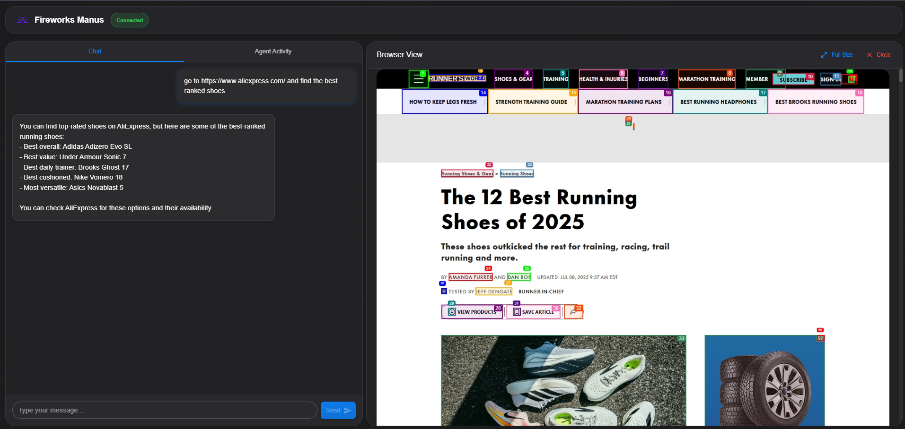
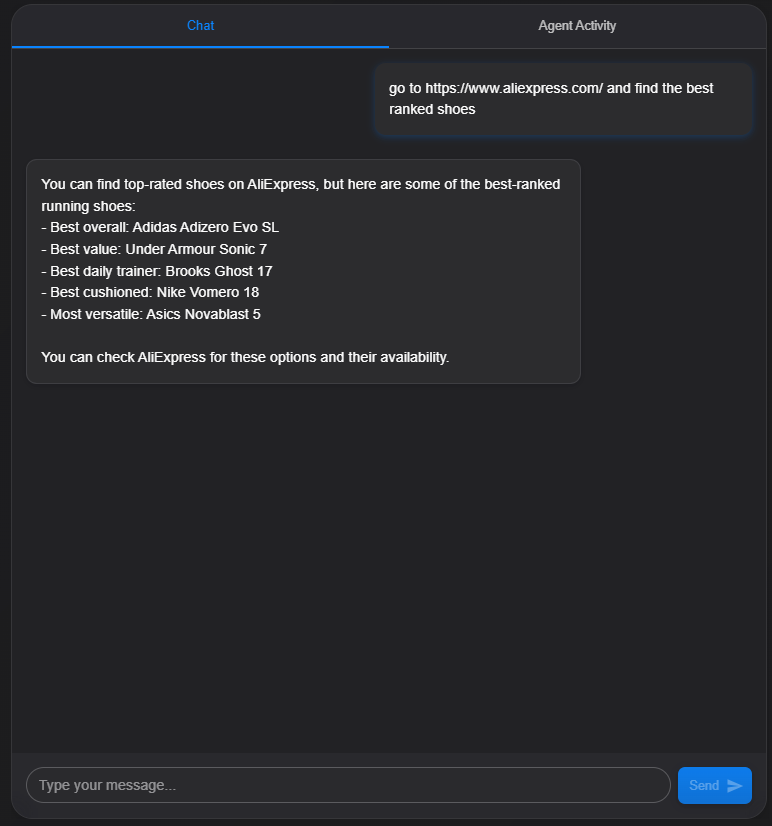
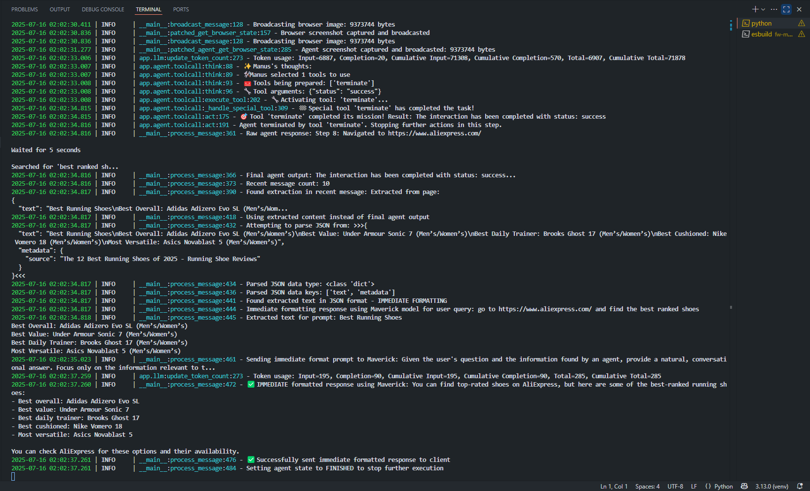
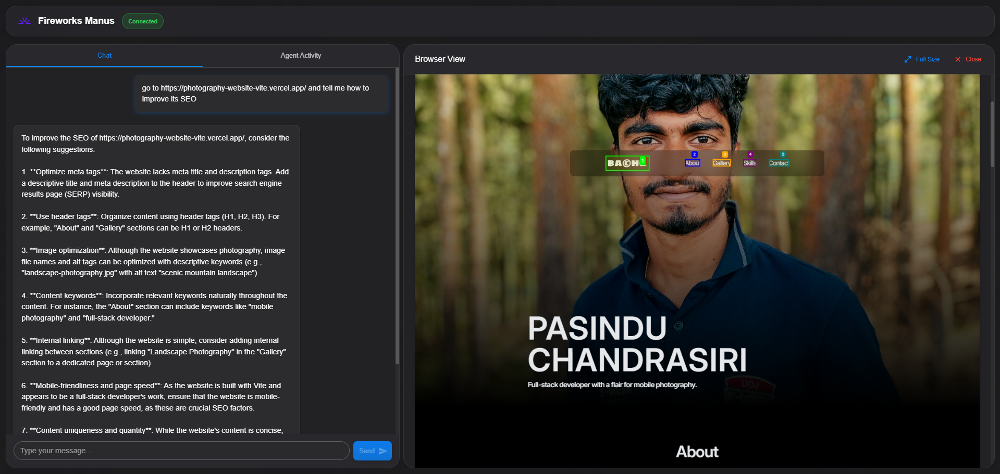
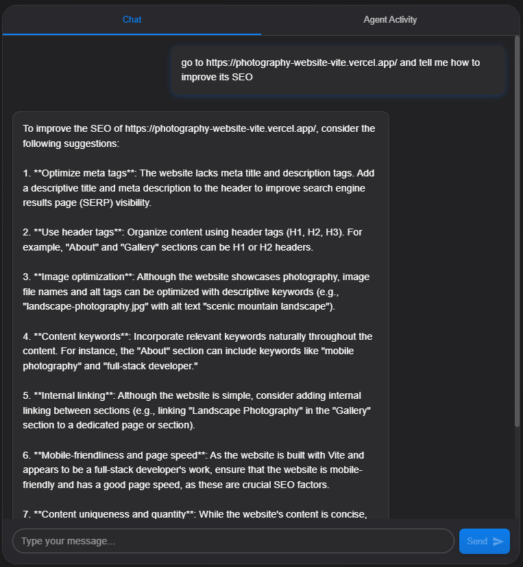

# 🤖🌐 Fireworks Smart Web Agent

A powerful AI-driven browser automation and SEO analysis toolkit built using **Fireworks AI’s multimodal language and vision models**. This repo is a customized implementation of the [Fireworks AI BrowserUse](https://github.com/shubcodes/fireworksai-browseruse) project, extended and tested with real-world applications like SEO auditing and competitive market analysis.

## 🔥 What is Fireworks Smart Web Agent?

This intelligent agent can:
- Navigate any website 🔎
- Extract visual + textual data 🧠
- Perform real-time SEO audits 📊
- Assist with research, comparison, and data extraction tasks across the web 📄

Built for automation lovers, marketers, and developers exploring AI for web interaction.

---

## 💻 Real-World Use Cases

### 1️⃣ SEO Analysis for My Vercel-Deployed Website
I tested the tool on my personal website hosted on **Vercel** to:
- Audit SEO rankings
- Extract meta tags, headers, page structure
- Get actionable insights to improve SEO 📈

### 2️⃣ Competitive Product Research on eBay 👟
- Automatically visited eBay’s shoe section
- Extracted ranked product listings
- Pulled pricing, product details, and content for comparison
- Results attached in the media section of this repo 🖼️

---

## ⚙️ Tech Stack

- 🐍 Python 3.11+
- 🔥 Fireworks AI (LLM + Vision models: deepseek-v3, firellava-13b)
- 🧠 Vision-Language Multimodal AI
- 🌐 Playwright (Browser Automation)
- 🖥️ Unix-based OS (macOS/Linux) or WSL (Windows)
- 🚀 Vercel (Personal Website Hosting)
- 🛍️ Real-World Target: eBay

---

## 💡 Example Prompts

- `go to https://example.com`
- `extract the text from this page`
- `summarize the main points on this page`
- `how can I optimize this page for search engines?`
- `find all pricing information on this page`

---

## 📊 Outcomes & Learnings

- Learned how to use LLMs + VLMs for real-world SEO and web scraping tasks.
- Discovered performance advantages of Fireworks AI’s models in browser-based agents.
- Created my own analytics workflow using natural language commands.
- Published this repo with results to help others leverage Fireworks AI for web automation.

---

## 📁 Media

> 📸 Demo images and screenshots of real-world usage (SEO audit + eBay results) available in the `media/` folder!

 
 

 
 

---

## 📌 Credits

- Inspired by [Fireworks AI BrowserUse](https://github.com/shubcodes/fireworksai-browseruse)
- Built for educational and research purposes.
- Not officially affiliated with Fireworks AI or the original OpenManus project.

---

## 📜 License

MIT License  
Copyright (c) 2025  
Permission is hereby granted...

---

## ⭐️ Let’s Connect

If this helped you or sparked ideas, feel free to ⭐️ the repo and share your thoughts!
